# WeChat mini-program whitebook

### PREFACE
China’s top messaging app WeChat rolled out something quite radical: mini-programs. Embedded apps which require no download, no install. Open, use, share, done! 

#### Yes, it's not perfect...
There is large debate – *and many clickbaits* – about how practical these apps are... Indeed the framework provided to developers is only at infancy stage, still limited, and honestly a bit frustrating. Nevertheless Tencent is investing unprecedented resources into the adoption of this channel, building momentum, and opening opportunities to the first-movers. We believe that these hackers may find quick-wins if they dare to give it a try. 

Got ideas of services you would like to deploy in WeChat asap? Have basic knowledge of Javascript and want to experiment with this framework? Got lost in the Google translation of the doc? Need a small boost to decrypt what is possible or not? Hello and welcome. 

#### Why this whitebook

Finding your way through the official doc is not easy. In fact, it requires a lot of trial/errors, some research on open-source code and many assumptions to get something done. You have been banging your head on the wall. We get it.

Our mission is to help creative entrepreneurs build great tech products. We will help you take the small steps. 

The whitebook below is not a translation of the documentation and will surely be outdated fast. It is simply our contribution to help any one get started and build a cool WeChat Mini-program fast. **Do it now.**

### Get in touch
Do [reach out to us](http://lewagon.com/shanghai) if you’d like to share your work and ask for help!

Or if you want to contribute, you can give us a shout on Shanghai@lewagon.com or send a Pull Request [here](https://github.com/apelegri/wechat-miniprogram-whitebook/pulls).

### Acknowledgements

This piece was written by [Adrien Pelegri](https://github.com/apelegri) with the support of [Thibault Genaitay](https://github.com/tgenaitay) and [Stephane Delgado](https://github.com/stephanedelgado).


## Summary

- [Registration process](#registration-process)
- [WeChat IDE](#wechat-ide)
- [Dig into the "quickstart" project](#dig-into-the-quickstart-project)
  - [Root directory](#root-directory)
  - [Quickstart project pages](#quickstart-project-pages)
  - [Take-away from the "quickstart" project](#take-away-from-the-quickstart-project)
- [The life cycle of your MP](#the-life-cycle-of-your-mp)
    - [Application life cycle](#application-life-cycle)
    - [Page life cycle](#page-life-cycle)
    - [App life cycle affects page life cycle](#app-life-cycle-affects-page-life-cycle)
- [Core setup of your MP](#core-setup-of-your-mp)
    - [Routing](#routing)
    - [TabBar](#tabbar)
    - [Window](#window)
    	- [Enable pull down refresh](#enble-pull-down-refresh)
    	- [Dynamic navbar title](#dynamic-navbar-title)
    - [Network timeout](#network-timeout)
    - [Debug](#debug)
- [Create dynamic pages](#create-dynamic-pages)
    - [WXML - HTML, what's the deal?](#wxml---html-whats-the-deal)
    - [Data binding](#data-binding)
    - [List rendering: wx:for](#list-rendering-wxfor)
    - [Conditional rendering: wx:if, wx:elif, wx:else](#conditional-rendering-wxif-wxelif-wxelse)
    - [Template](#template)
    	- [Import a template](#import-a-template)
    	- [Define a template](#define-a-template)
    - [Events](#events)
    	- [Event handler](#event-handler)
    	- [Event binding](#event-binding)
    	- [Event types classification](#event-types-classification)
    - [Mini-program sharing](#mini-program-sharing)
    	- [Enable the forward button of the drop-down menu](#enable-the-forward-button-of-the-drop-down-menu)
    	- [Create a forward button within the current page](#create-a-forward-button-within-the-current-page)
- [WeChat design guidelines](#wechat-design-guidelines)
    - [WXSS](#wxss)
    - [Style import](#style-import)
- [Built-in components](#built-in-components)
    - [Navigator](#navigator)
    - [Picker](#picker)
    - [Switch](#switch)
    - [Toast](#toast)
    - [Modal](#modal)
    - [Scroll view](#scroll-view)
- [Leancloud DB](#leancloud-db)
    - [Create a form](#create-a-form) 
    - [Install and initialize Leancloud](#install-and-initialize-leancloud)
    - [Create an object and encapsulate data](#create-an-object-and-encapsulate-data)
    - [Persist objects on Leancloud](#persist-objects-on-leancloud) 
    - [Leancloud dashboard](#leancloud-dashboard)
    - [Module](#module)
    - [Fetch data stored on Leancloud](#fetch-data-stored-on-leancloud)
    - [Recommendations:](#recommendations)
    - [Production: domain name whitelist](#production-domain-name-whitelist)
- [WeChat API](#wechat-api)
    - [Get user information](#get-user-information)
    - [Data cache](#data-cache)
    - [Open the QR code scanner](#open-the-qr-code-scanner)
    - [Location-based services](#location-based-services)
    - [Image](#image)

## Registration process
The registration process is really tough, especially if you don’t have any experience with the fantastic Chinese administrative world. 
The WeChat verification process will be long. Keep your calm.

From the WeChat mini-program registration, until the development release, you basically need to go through these steps: 

- [Create an account](https://mp.weixin.qq.com) on WeChat back-end.
- **Pick the right type of application** and go through the registration process.
- Complete the **mini-program certification** process.
- Fill in your mini-program information.

Here is a list of materials you will need to register a mini-program as a company:

* Email, to create your Wechat account. 
* Chinese ID. This person will own the account and scan QR codes a lot.
* Phone number, to certify your identity during the verification process.
* Chinese business license, to register as an enterprise.
* Company documents: organisation code, certificate and enterprise bank account.
* Fill in the official letter Tencent provides, sign it (by the admin) and stamp it with the enterprise stamp. Upload it.

We recommend you follow this comprehensive English manual on how to register and create a mini-program project: [Medium article](https://medium.com/@yelin.qiu/a-complete-manual-on-wechat-mini-program-development-8fd28a85ee0d) 
or check this [official WeChat documentation](https://mp.weixin.qq.com/debug/wxadoc/introduction/index.html?t=201758) (Chinese).

## WeChat IDE

**What's this?**  
An [IDE](https://mp.weixin.qq.com/debug/wxadoc/introduction/index.html?t=201758) (integrated development environment)  is a set of programming tools for writing an application. It consists of a code editor, a compiler and a debugger, accessible through a single graphical user interface. 
 
Download the WeChat IDE here: 
 [Mac](https://servicewechat.com/wxa-dev-logic/download_redirect?type=darwin&from=mpwiki), [Windows 64](https://servicewechat.com/wxa-dev-logic/download_redirect?type=darwin&from=mpwiki), [Windows 32](https://servicewechat.com/wxa-dev-logic/download_redirect?type=ia32&from=mpwiki)
 

**Quick tutorial to master the WeChat IDE**  

A **Code editor** with the tree of your files on the side and a **Simulator** on the left, which displays the preview of your app.
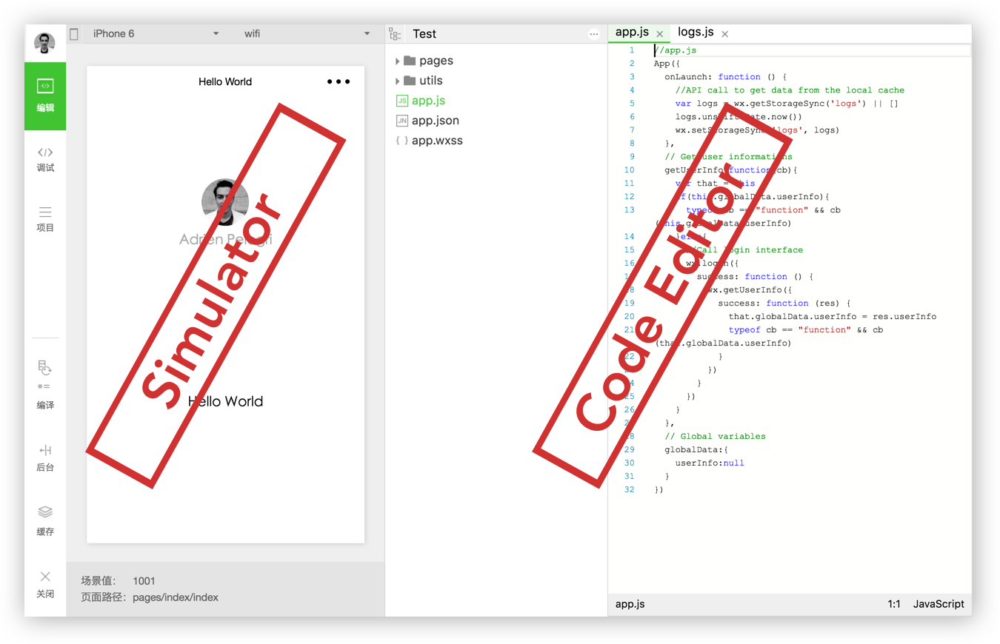

Here is a complete list of buttons to perform tasks when you are in development:  

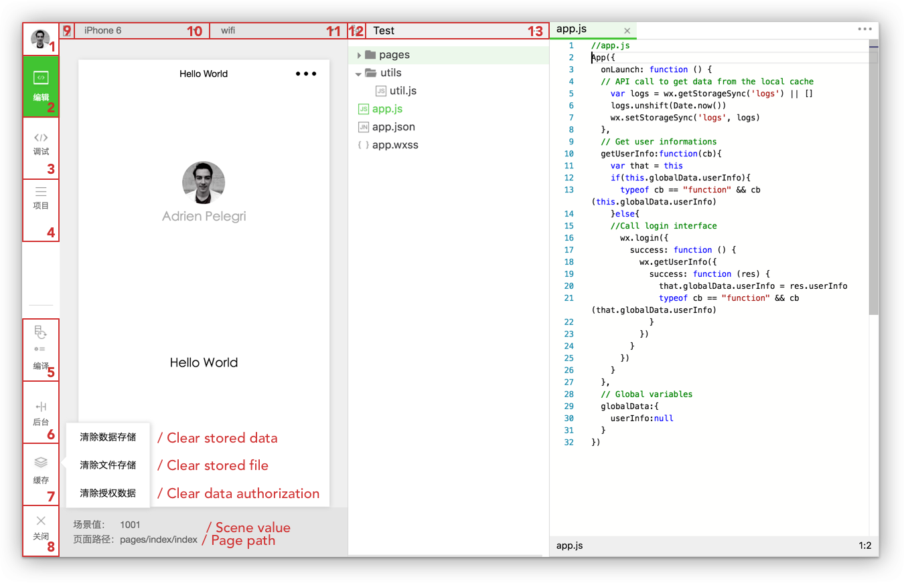

**1. 	Profile:** click on it to log out from the IDE.  
**2.	Code Editing**  
**3.	Debug / Inspect:** see below.  
**4.	Project information:** see below.    
**5.	Compiler:** Can be usefull to compile the app when the auto-refresh of the view is not working.
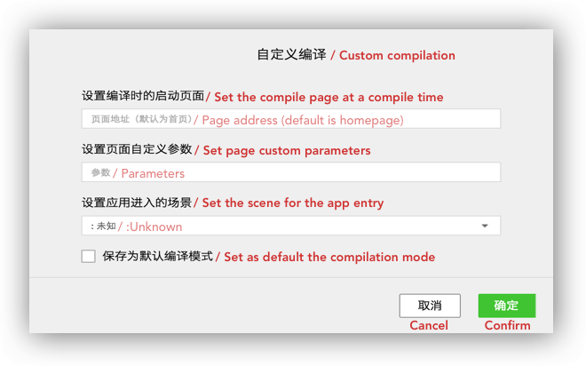

**6.  Scene value**  
**7.	Cache**    
**8.	Shut down:**  Quit the project you are on and move toward another one.   
**9.	Hide the simulator**  
**10. Devices:** It gives a list of devices to test mini-program responsivness.  
**11.	 You can work on:** wifi, 4G, 3G, 2G.  
**12. Hide arborescence**  
**13. Manage your files:**  Search, add and delete a folder or a file.


**Debugger / Inspector:**  
This tool is an important part of the IDE, it looks like the good old *Chrome DevTools*. 
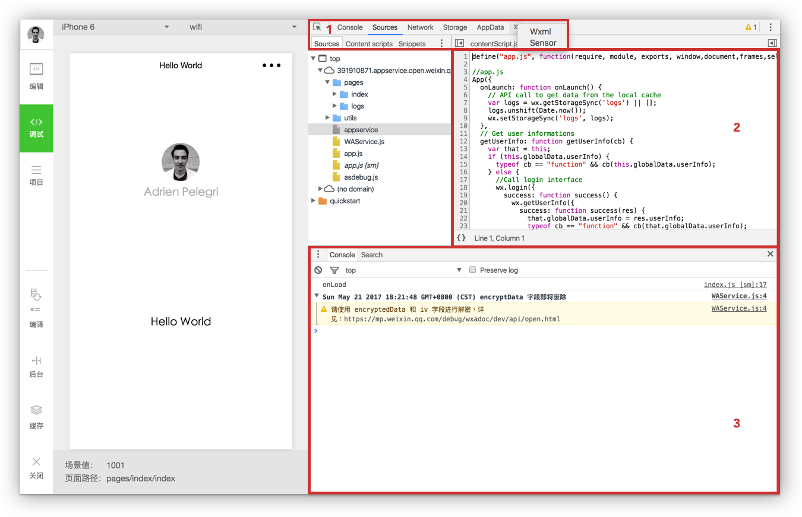

 **1. Top bar** 
      
 **Network:** This panel is to debug request and socket issues or page load performance.  
**Storage:** allows to access all the data you have in your cache.  
**AppData:** is used to display the current project data. You can directly edit the data in the panel and preview it.   
**Wxml:** let you inspect and edit on the fly every elements of your page.  
**Sensor:** you can simulate location and the performance of the mobile device to debug gravity sensing.  
  
 **2. Sources panel**   
Sources panel displays the current project script files.  
   
 **3. Console**  
 The console will let you know what errors you have in your code by logging diagnostic information and interact with javascript in the page as your **console.log()** you have placed and more. 


**Project information:**  
This page is where you will find the current project details as your AppID, directory information and more.  By clicking on the **preview option** you will be able to test the mini-program directly on your phone after scanning a QR code.

**Note:**
While you are testing your mini-program on your phone, you can enable the debugger tool directly on your device.    

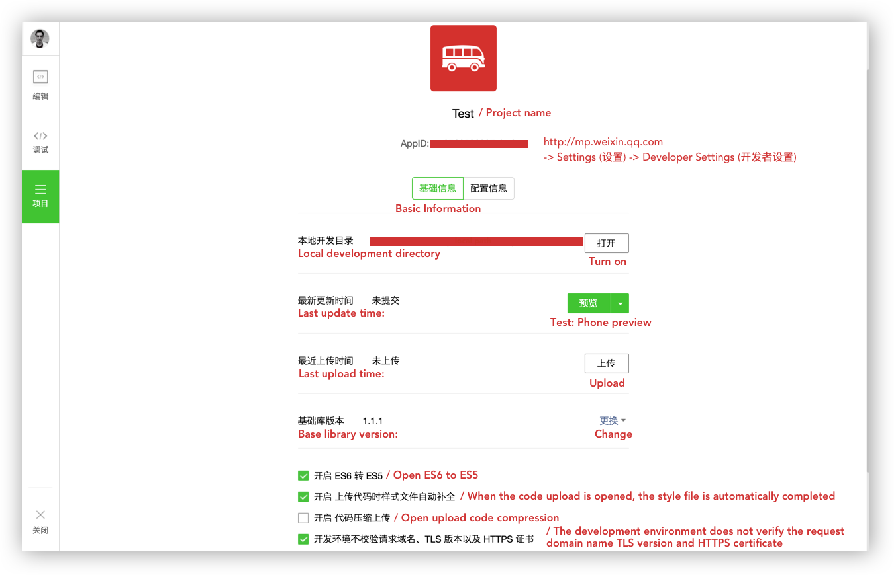 

## Dig into the "quickstart" project
This section will introduce the structure of the **"quickstart" provided by WeChat** (boilerplate) and the fundamentals you need to comply with this framework.   
 
Download WeChat [quickstart.zip](assets/quickstart.zip). 

**Quickstart arborescence:**

<pre class="bash hljs">
.
├── <strong style="color: #117B8D">app.js</strong>
├── <strong style="color: #117B8D">app.json</strong>
├── <strong style="color: #117B8D">app.wxss</strong>
├── <strong style="color: #117B8D">pages</strong>
│   ├── <strong style="color: #117B8D">index</strong>
│   │   ├── index.js
│   │   ├── index.json
│   │   ├── index.wxml
│   │   └── index.wxss
│   └── <strong style="color: #117B8D">logs</strong>
│       ├── logs.js
│       ├── logs.json
│       ├── logs.wxml
│       └── logs.wxss
└── <strong style="color: #117B8D">utils</strong>
    └── util.js
</pre>


The index page of this boilerplate displays a welcome page with the current user profile's information. A click on your avatar will redirect to a new page displaying your current mini-program logs. 

### Root directory


WeChat mini-programs start with **"app" files** (see the screenshot below). These files are the mini-program root directory therefore the entrance of your mini-program.  (Here is the official [WeChat documentation](https://mp.weixin.qq.com/debug/wxadoc/dev/framework/structure.html )). 

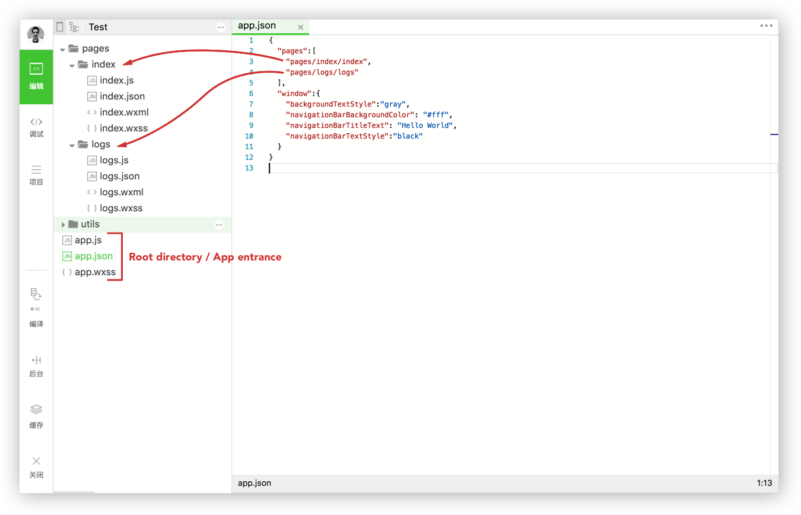
**app.js** is the script code, the global logic of your mini-program. You can setup and manipulate the [life cycle functions](#application-life-cycle) of your MP, declare global variables or call an API.

**`Code snippet of the "app.js" file.`** 

```javascript
// app.js
App({
  onLaunch: function () {
  // API call to get data from the local cache
    var logs = wx.getStorageSync('logs') || []
    logs.unshift(Date.now())
    wx.setStorageSync('logs', logs)
  },
  // Get user information
  getUserInfo:function(cb){
    var that = this
    if(this.globalData.userInfo){
      typeof cb == "function" && cb(this.globalData.userInfo)
    }else{
    // Call login interface
      wx.login({
        success: function () {
          wx.getUserInfo({
            success: function (res) {
              that.globalData.userInfo = res.userInfo
              typeof cb == "function" && cb(that.globalData.userInfo)
            }
          })
        }
      })
    }
  },
  // Global variable
  globalData:{
    userInfo:null
  }
})
```

**app.json** is the global configuration of the overall mini-program. You can configure, MP (mini-program) page’s path, the MP window style, set the network timeout and debug configuration. 

**`Code snippet of the "app.json" file.`** 

```javascript
{
  "pages":[
    "pages/index/index",
    "pages/logs/logs"
  ],
  "window":{
    "backgroundTextStyle":"gray",
    "navigationBarBackgroundColor": "#fff",
    "navigationBarTitleText": "Hello World",
    "navigationBarTextStyle":"black"
  }
}
```
**Note:** you cannot add any comment in the **app.json**.

**app.wxss** is the global style sheet of the mini-program. You should declare common style rules here.
    
### WeChat "quickstart" pages 


The **two pages** of WeChat quickstart are:

- **index page** which is the welcome page.  
- **logs page** which displays current user mini-program logs. 


**Pages** folder is where you have or create your mini-program pages. Each page you create is **required to contain two files:**
 
 - **.js** file for the logic of your interface.
 - **.wxml** file for the interface layout. 

You can add two more files in each page you create:

-  **.json** file for page configuration. 
-  **.wxss** file for the style sheet of your interface.  
  
  
**Rule:**   
Each page of your mini-program can be composed of four different file extensions (js ; json ; wxml ; wxss)  but **should have the same name.**

  
**Further details:**  
A new page will always contain a **.js** file and a **.wxml** file minimum. The **.json** file extension is used just in case you want to override the [window configuration](#window) in this particular page. Add **.wxss** if you want to add a style sheet to your page.

Let's see what happens in each page of the quickstart project.  

**`Code snippet of the "index.js" file.`**

```javascript
// index.js
// Get application instance
var app = getApp()
Page({
  data: {
    motto: 'Hello World',
    userInfo: {}
  },
  // Event that redirect user to logs page
  Tapped: function() {
    console.log("tapped");
    wx.navigateTo({
     url: '../logs/logs'
    })
  },
  onLoad: function () {
    console.log('onLoad')
    var that = this
    // Call the application instance to get data 
    app.getUserInfo(function(userInfo){
      // Updates userInfo data
      that.setData({
        userInfo:userInfo
      })
    })
  }
})
```

**Snippet comments:**  
   
1. The snippet above assigns the **app instance** to a variable. This app instance will be called in `Page()`function later on to collect user information. 
2. Next it registers a `Page()` function and sets `data:` to dynamically bind data into the view.
3. `Tapped`function redirects the current user to his logs page.
4. `onLoad` function  gets user information and  updates `userinfo` data.


  
**`Code snippet of the "logs.js" file.`**

```javascript
// logs.js
var util = require('../../utils/util.js')
Page({
  data: {
    logs: []
  },
  onLoad: function () {
    console.log(wx.getStorageSync('logs'))
    this.setData({
      logs: (wx.getStorageSync('logs') || []).map(function (log) {
        return util.formatTime(new Date(log))
      })
    })
  }
})
```


**Snippet comments:**  

1. First it requires **util.js** in the purpose of calling `formatTime` later on. 
2. It registers `Page()` function and sets `data:`.
3. `onLoad` function **retrieves current user logs**  from the cache `wx.getStorageSync('logs')`. Then render logs in `formatTime` which is provided by the require of **util.js**.


**`Code snippet of the "utils.js" file.`**
 
```javascript
function formatTime(date) {
  var year = date.getFullYear()
  var month = date.getMonth() + 1
  var day = date.getDate()

  var hour = date.getHours()
  var minute = date.getMinutes()
  var second = date.getSeconds()


  return [year, month, day].map(formatNumber).join('/') + ' ' + [hour, minute, second].map(formatNumber).join(':')
}

function formatNumber(n) {
  n = n.toString()
  return n[1] ? n : '0' + n
}

module.exports = {
  formatTime: formatTime
}
```
**Note:**  
The Utils folder is used to **import libraries** and require them when you need it. In the code snippet above **util.js** file creates a `formatTime` function to display the date of your logs properly.  You may recall the require of **util.js** in **logs.js** file.

### Take-away from the "quickstart" project
Up to now you catch the fact that you will have **two layers in each page:**

- **Logical layer (.js):** process the data and send it to the view layer, while receiving events triggered from the view layer.

- **View layer (.wxml/.wxss):** display the data processed by the logical layer into a view, while sending the events of the view layer to the logical layer.

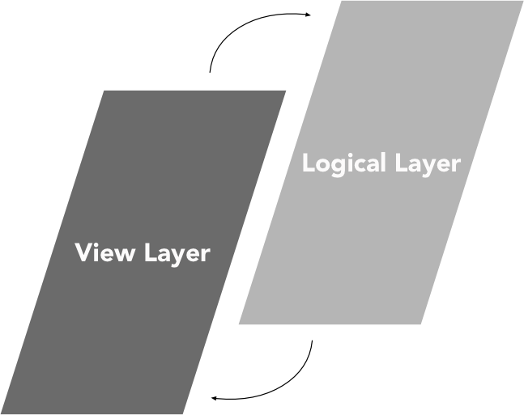 

## The life cycle of your MP

We can break-down a mini-program life cycle in two cycles, the application cycle and the page cycle. 
The **`App()`** life cycle is the **start and end point** of the mini-program whereas **`Page()`** life cycle is activated when users browse through the mini-program.

### Application life cycle 

`App()` function is used to register a mini-program. It accepts an object as a parameter which specifies life cycle functions of a MP.    

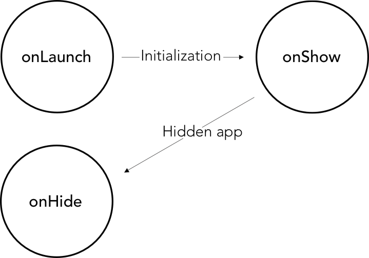  

**Comments:**   

1. A user opens the mini-program which triggers **`onLaunch`** function and initialize the MP. 
2. When the initialization is completed, the **`onShow`** function is triggered. 
3. The **`onHide`** function is triggered when the current user quit the mini-program.   


   
**`Code snippet of the "App()" life cycle functions.`**

```javascript
App({
  onLaunch: function() {
    // Do something when launch.
  },
  onShow: function() {
    // Do something when show.
  },
  onHide: function() {
    // Do something when hide.
  },
  onError: function(msg) {
    console.log(msg)
  },
  globalData: 'I am global data'
})
```

WeChat framework offers a global function called `getApp()` which is an instance of `App()`. 

**`Code snippet  "getApp()" function.`**

```javascript
// .js
var appInstance = getApp()
console.log(appInstance.globalData) // I am global data
``` 

`getApp()` function, can be useful  for the simple reason that you can’t define the `App()` function  inside of a `Page()` function. In order to access the app instance you must call `getApp()` function.

### Page life cycle

`Page()`  function is used to register a page. It accepts an object as a parameter, that specifies the initial data for the page, life cycle functions,  event handler and so on.    
 
 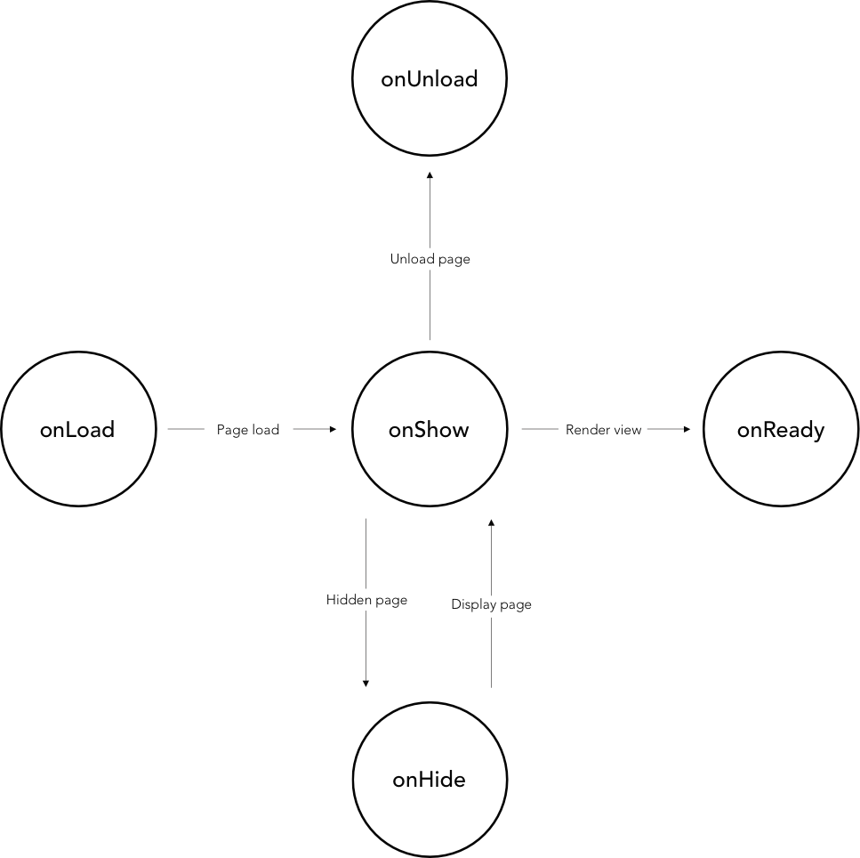  
   
 **Comments:**  

1. After page registration, the framework calls the **`onLoad`** function.
2. When a page load, it calls the **`onShow`** function.
3. The first time the page is displayed, **`onShow`** function calls **`onReady`** to render the view.
4. When it is not the first time, **`onShow`** function directly  renders a view.
5. The **`onHide`** is triggered when the mini-program jumps to another page. 
6. **`onUnload`** function is called when you quit a page by using `wx.redirectTo()`and  `wx.navigateBack()`. Or when the current page is relaunched, `wx.reLaunch`.

**`Code snippet  of  "Page()" life cycle functions.`**
 
```javascript
Page({
  data: {
    text: "This is page data."
  },
  onLoad: function(options) {
    // Do some initializations when page load.
  },
  onReady: function() {
    // Do something when page ready.
  },
  onShow: function() {
    // Do something when page show.
  },
  onHide: function() {
    // Do something when page hide.
  },
  onUnload: function() {
    // Do something when page close.
  },
  // Event handler
  viewTap: function() {
    this.setData({
      text: 'Set some data.'
    })
  }
})
```
 
### App life cycle affects page life cycle

 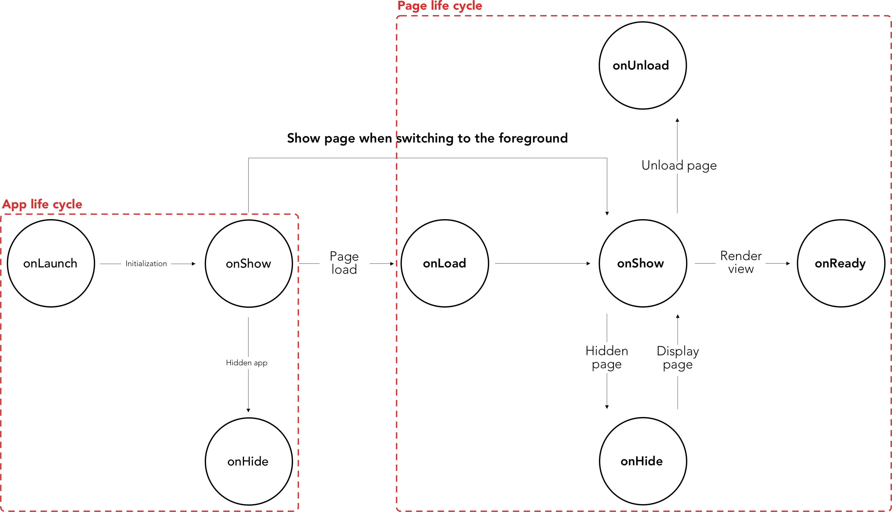  
 
When the **`App()`** life cycle  is complete, the page loads by calling **`onLoad`** for the first time, and will only call it once.   
 
When the mini-program is running from the background (app life cycle) to the foreground (page life cycle), it first calls the **`App()`** `onShow` function and then calls the **`Page()`** `onShow` function when switching to the foreground.

**WeChat recommendations:**  
  
- `App()` function cannot be reused and should be register once in the **app.js**. 
- Do not call `onLaunch` when the `getCurrentPages()` page is not yet generated.
- By using `getApp()`you can obtain an **instance of App()** but lifecycle functions don’t attempt to call the `App()` functions.  
 
## Core setup of your MP
The setup of your mini-program is simple
and designed  to save time or being frustrated if you have customization needs.   
  
WeChat divides the **app.json configuration** in five parts:  
 
- Routing
- TabBar 
- Window
- Network timeout
- Debug  

In this part we will **break-down** this complete **app.json setup** exemple.

**`Code snippet "app.json complete setup" example`**

```javascript
{
  "pages":[
    "pages/index/index",
    "pages/form/form",
    "pages/wagon/wagon",
  ],
  "window":{
    "navigationBarBackgroundColor": "#D03232",
    "navigationBarTextStyle": "white",
    "navigationBarTitleText": "Le Wagon",
    "backgroundColor": "#eeeeee",
    "backgroundTextStyle": "light",
    "enablePullDownRefresh": true
  },
  "tabBar": {
    "backgroundColor": "#FFFFFE",
    "borderStyle": "#D3D3D3",
    "selectedColor": "#D03232",
    "color": "#131313",
    "list": [{
      "pagePath": "pages/index/index",
      "iconPath": "image/form.png",
      "selectedIconPath": "image/form-hover.png",
      "text": "Form"
    }, {
      "pagePath": "pages/wagon/wagon",
      "iconPath": "image/about.png",
      "selectedIconPath": "image/about-hover.png",
      "text": "About"
    }]
  }
}
```


### Routing

`pages` role in **app.json** is to **define all routes**  of your mini-program. This item configuration is of course **required** and it **accepts an array of strings**. Every sub-folders and files within the parent pages folder correspond to the **routing path**.  

**`Code snippet  of  the "app.json" file. `**  
   
```javascript
{
  "pages":[
    "pages/index/index",
    "pages/form/form",
    "pages/wagon/wagon"
  ]
} 
``` 

**Tip:**  
Each time you **add a route path** to `"pages"`, the IDE will **automatically create** the folder and files that corresponds to the path  you just created. 


**The WeChat framework brings several routing logics:**   

    
 
**Routing mode description:** 

- **Initialization:** 
Once the mini-program is launched, the first page is loaded by `onLoad` and `onShow` function.

- **Open a new page:** 
Opening a new page hides the current page and jumps to another one using the `wx.navigateTo`. 
Behind the scene the first page will be hidden by the call of the **onHide** function and jump over the other page by calling **onLoad** and **onShow**. 
   
 
- **Page redirection:** 
Close the current page by calling **onUnload** and jumps to a page within the app using `wx.redirectTo` which call **onLoad** and **onShow** functions.

- **Page return:** 
`onUnload` the current page, calls `onLoad` function and then displays the target page by calling `onShow`.

- **Reloading,** `wx.reLaunch`:
Close all pages and reloads the current page.

- **Switch tabs,**  `wx.switchTab`: Jumps from one tabBar page to another one and close or hides all other non-tabBar pages by using **onUnload, onHide and onShow**. Discover all possible [scenarios for tabs switching](https://mp.weixin.qq.com/debug/wxadoc/dev/framework/app-service/route.html).  
 
 **Switch tabs, navigation restrictions:**  

 * No callback at the top of the page.  
 * The tabBar path cannot take parameters.
 
**WeChat recommendations:**  
 
-	`navigateTo`, `redirectTo` can only open a non-tabBar page.
-	`switchTab` can only open and display tabBar page.
-	`reLaunch` can be used for every pages.
-	 The tabBar at the bottom of the page is displayed **according to the page you are on.** As long as the page you are on is defined in the tabBar, the tabBar will be display.
-    **Page stack modification** will lead to routing and page status error, it is not recommended. Dig further in [pages stack mecanism](https://mp.weixin.qq.com/debug/wxadoc/dev/framework/app-service/route.html).

**`getCurrentPages()`**:  
This function is used to **get the instance of the current page stack.** It is given as an array in the page stack order. The first item of the array is the first page and the last item the current page. 

### TabBar

`tabBar`  item as a name suggets is to configure mini-program top or bottom tab bar. **`tabBar` is an array** which can configure a minimum of 2 tabs and a **maximum of 5 tabs.**

 **`Code snippet  of the "app.json" file.`**
  
  ```javascript
{
"tabBar": {
    "backgroundColor": "#FFFFFE",
    "borderStyle": "#D3D3D3",
    "selectedColor": "#D03232",
    "color": "#131313",
    "list": [{
      "pagePath": "pages/index/index",
      "iconPath": "image/form.png",
      "selectedIconPath": "image/form-hover.png",
      "text": "Form"
     }, {
      "pagePath": "pages/wagon/wagon",
      "iconPath": "image/about.png",
      "selectedIconPath": "image/about-hover.png",
      "text": "About"
    }]
  }
}
  ```  

**Attributes indication:**  
 
  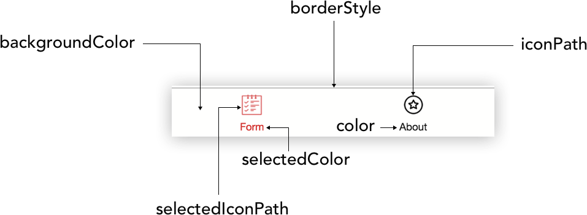   
  
  
Using the `tabBar` `list` key, requires an object in each element of the array.  

**`List` attributes values are as follow:**   
 
   
 
 
**TabBar attributes description:**    
   
 
 
**WeChat recommendations:**  
 
- Setting your `tabBar` position to top could not display icons.
- The limit size of your icons in the bottom `tabBar` are, 40kb, 81px*81px.
   
 
### Window
The window item is used to set mini-program title and common window style.  

**`Code snippet  of the "app.json" file.`** 
  
 ```javascript
"window": {
   "navigationBarBackgroundColor": "#D03232",
   "navigationBarTextStyle": "white",
   "navigationBarTitleText": "Le Wagon",
   "backgroundColor": "#eeeeee",
   "backgroundTextStyle": "light",
   "enablePullDownRefresh": true
  }
 ``` 
  
**Window attributes description:**  

     
 

#### Enable pull down refresh
 
`"enablePullDownRefresh": true` needs to be configured in the global **app.json** as above and then you can call `onPullDownRefresh() ` in mini-program pages.

 **`Code snippet  of the "Enable pull down refresh in a page" file.`** 
 
```javascript
 // .js
 Page({
   // Pull down the trigger event 
  onPullDownRefresh() {
    // Stop the dropdown refresh
    wx.stopPullDownRefresh()
  }
}}
``` 
 
#### Dynamic navbar title

WeChat offers the possibility to **change the title** of the top **navigation bar** within each page.

 **`Code snippet  of the "change navbar title" file.`** 

```javascript
// .js
Page({
  // Loading spinner when page load
  onload: function (){
   wx.showNavigationBarLoading()
  },
  // Change naviagtion bar title
  onShow: function () {
   wx.setNavigationBarTitle({
    title: 'Change navabar title',
    success: function(res){
      console.log(res)
    }
   })
  }
})
```

 
 

### Network timeout

Network timeout may be provided in a variety of network requests. 
Here is the link to the [WeChat documentation](https://mp.weixin.qq.com/debug/wxadoc/dev/framework/config.html )  if you want to go further.

### Debug

Here is a link to the [WeChat documentation](https://mp.weixin.qq.com/debug/wxadoc/dev/framework/config.html).


## Create dynamic pages
  
### WXML - HTML, what's the deal?
**WXML** is a WeChat markup language similar to HTML. It combines a **basic library of components** and **an event system** to build dynamic pages. 


The WeChat event system behaves like classic Javascript events which **handle logical responses to the view layer.**  
 
 The table below lists the **significant differences** you will face in development between **WXML / HTML:**  
  
   
 
 **Note:** All components and attributes are lowercase.
  
### Data binding
 
The Mini-program framework does not allow developers to use the DOM to control your WXML elements. Instead, you will **update your view layer** (.wxml file) **via data binding method:**  

   
 
In order to comply with WeChat requirements the `data` attribute has to be initialized **as a JSON format** within `Page()` function. **Data binding** technique allows to **update data dynamically** within the view layer.  
 
A good practice is to initialize `data` at the top of the `Page()` function.  

**`Code snippet "data binding" example.`**
 
```html
<!-- .wxml -->
<view>{{text}}</view>
<view>{{array[0].msg}}</view>
```
 
```javascript
// .js
Page({
  data: {
    text: 'init data',
    array: [{msg: '1'}, {msg: '2'}]
  }
}
```
As you seen above the dynamic `data:` we want to pass to the view layer correspond to the data attribute from `Page()` function. 

**Data binding syntax:**  
Data binding uses [Mustache syntax](https://mustache.github.io/mustache.5.html) (double braces) to **wrap variables.** This syntax is a logic less template engine analysis. In short it is very convenient and easy to use.  

WeChat offers lot of possibilities regarding [data binding usage](https://mp.weixin.qq.com/debug/wxadoc/dev/framework/view/wxml/data.html ). You have the oportunity to use data binding on component attributes, properties, string operations, arithmetic operations, data path and array.

### List rendering: wx:for
The `wx:for` control property binds an array from your logical layer (.js file), loops through it and assigns the data. 

 **`Code snippet "wx:for" example.`**
   
```html
<!-- .wxml -->
<view wx:for="{{array}}">
  {{index}}: {{item.message}}
</view>
``` 
```javascript
// .js
Page({
  data: {
    array: [{
      message: 'foo',
    }, {
      message: 'bar'
    }]
  }
})
```

Similar to `view wx:for` you can use **`block wx:for`** to render **multiple lines** block. (See [block](#wxml---html-whats-the-deal) in the WXML table above).

**`Code snippet "block wx:for" example.`**

```html
<!-- .wxml -->
<block wx:for="{{array}}" wx:for-item="array-item" wx:key="key">
  <view class="card">
    <view class="card-description">
    </view>
  </view>
</block>
```
For more details on the code above see this [Github repository](https://github.com/apelegri/wagonform-wechat-mp/tree/master/pages/form). 

**Further resources:**

- For more details about list rendering refer to [WeChat documentation ](https://mp.weixin.qq.com/debug/wxadoc/dev/framework/view/wxml/list.html ).


### Conditional rendering: wx:if, wx:elif, wx:else 

Similar to `wx:for`, **`wx:if`** is used to define a condition statement and to determine if the block should be rendered or not.  
  
**`Code snippet "wx:if" example.`**
 
```html
<!-- .wxml -->
<!-- Add additional conditions wx:elif ; wx:else -->
<view wx:if="{{length > 5}}"> 1 </view>
<view wx:elif="{{length > 2}}"> 2 </view>
<view wx:else> 3 </view>
```  

```javascript
// .js
Page({
  data: {
    length: 10
  }
})
```  
If you want to display **more than one tag** within your **conditional statement block** you can use **`block wx:if`**.

```html
<!-- .wxml -->
<block wx:if="{{true}}">
 <view> view1 </view>
 <view> view2 </view>
</block>
```

Dig further in `wx:if` [WeChat documentation](https://mp.weixin.qq.com/debug/wxadoc/dev/framework/view/wxml/conditional.html).
 
### Template

Templates allow to define code snippets you want to reuse several times in different files of your mini-program.

WXML template item has its own scope and can only use data to pass in.

#### Define a template 

First, to declare a template you need to define its name.

**`Code snippet  "template" example. `**
 
```html
<!-- .wxml -->
<template name="msgItem">
  <view>
    <text> {{index}}: {{msg}} </text>
    <text> Time: {{time}} </text>
  </view>
</template> 

<!-- Call the template -->
<template is="msgItem" data="{{item}}"/>
```

Later on if you want to call a template within the same file use the **`is` attribute** and the **template name as a value** to declare the required template. And don't forget to pass data to the template using the `data` attribute.   

```javascript
// .js
Page({
  data: {
    item: {
      index: 0,
      msg: 'this is a template',
      time: '2017-05-18'
    }
  }
})
```

#### Import a template 

To declare a template already defined in a new file you first have to import the template.

**`Code snippet "define a template in a specific file" exemple`**

```html
<!-- item.wxml -->
<template name="item">
  <text>{{text}}</text>
</template>
```

**`Code snippet "import and call the template in index.wxml" exemple`**

```html
<!-- index.wxml -->
<import src="item.wxml"/>
<template is="item" data="{{text: 'forbar'}}"/>
```

More details on the WeChat documentation [here](https://mp.weixin.qq.com/debug/wxadoc/dev/framework/view/wxml/template.html).

### Events

#### Event handler
  
In addition to data initialization and life cycle functions, the framework allows to define **event handling functions.** 

WXML element (event handler) triggers the event and the **logical layer binds the event handler** to receive an event object as a parameter.   
 
 **`Code snippet "event handler" example.`** 
 
```html
<!-- .wxml -->
<view bindtap="add">{{count}}</view>
```  

```javascript
// .js
Page({
  data: {
    count: 1
  },
  add: function(e) {
    this.setData({
      count: this.data.count + 1
    })
  }
})
```  

**`setData()` :**   
This function **updates data** within the logical layer which next will be send to the view layer.
`setData()` function receives an object as a parameter and updates the key value by using `this.data` as a **data path.**  


#### Event binding
  
There are many kind of binding events, most components have their own definition of binding event.  

**Components binding events:**  

- **`bindsubmit`** for a fom.
- **`bindinput`** for an input.
- **`bindscroll`**  for a scroll-view.

**`Code snippet "form binding event" example.`**

```html
<!-- form.wxml -->
<form bindsubmit="bindFormSubmit">
  <!-- Form inputs -->
  <button type="primary" form-type="submit">Submit</button>
</form>
```

```javascript
// form.js
// Form submission function
Page({
 bindFormSubmit: function(e) {
   // Treatment
 }
})
```


**Classic binding events:**

- **`bind+event_type`**
- **`catch+event_type`** 


The two common binding events used are `bind+event_type` and `catch+event_type`. The **catch event** is the one that prevent against bubbling events.  
 
**Bubbling event concept:**   
For none javascript person, **bubbling event**, can be defined when an event occurs in **an element nested in another element.** Both elements the parent node and the nested element are **register as a handler** for that particluar event.
To prevent **against  bubbling events**, the parent node of the nested element should use `catch+event_type`, it will **counteract the bubbling event effect.**

**`Code snippet  "counteract bubbling effect with catchtap" example.`**
 
```html
<!-- .wxml -->
<view id="outter" bindtap="handleTap1">
  outer view
  <view id="middle" catchtap="handleTap2">
    middle view
    <view id="inner" bindtap="handleTap3">
      inner view
    </view>
  </view>
</view>
```

```javascript
// .js
Page({
  handleTap1: function(e) {
    console.log('outter')
  },
  handleTap3: function(e) {
    console.log('inner')
  },
  handleTap2: function(e) {
    console.log('middle')
  }
})
```

Mostly used when you nest elements and don’t want to display the parent node of the element you bind.

#### Event types classification

   
 
 **`Code snippet  "tap and longtap event binding" example.`**
 
```html
<!-- index.wxml -->
<button bindtap="ontap" type="primary">Tap<button/>
<button bindlongtap="onlongtap" type="primary">Long tap<button/>
```

```javascript
// index.js
Page({
  ontap: function() {
    console.log('tap');
  },
  onlongtap: function() {
    console.log('longtap');
  }
})
```


### Mini-program sharing

Here are practical tips to enable the mini-program sharing. 
WeChat opens up two ways to share a mini-program:

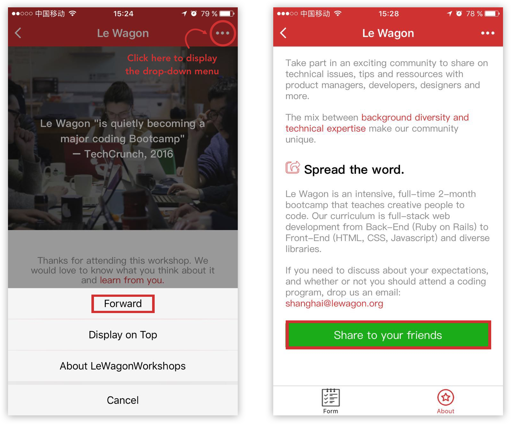  

1. Possibility to **enable the forward button** within the **drop-down menu** that appears by clicking on the **upper right corner** `...` of the page.  

2. **Create a forward button within the page** of your mini-program. It makes the sharing process more user friendly.

In both variants, the framework will **automatically** forward a mini-program card with a **screen shot** of your MP header. 

#### Enable the forward button of the drop-down menu

To enable this button we need to use  a `Page()`function called `onShareAppMessage`. 

**`Code snippet  "Enable the forward button of the drop-down menu" example. `**
 
```javascript
// index.js
onShareAppMessage: function () {
    return {
      title: 'Le Wagon coding school',
      path: 'pages/index/index'
    }
  },
```
In this function you have to **define a title** that will be displayed on the top of the forward card and the **current page path**. If you forget to add a title WeChat will add one by default (your mini-program name).

**Restriction:**  
The only thing that you can define in this case is the **event** `onShareAppMessage`. The forward button will be **created by the framework** itself. 


####  Create a forward button within the current page

This feature allows developers to create a specific forward button within the page by using the button property `open-type` and its value `'share'`.  

**`Code snippet  "Create a forward button within the page" example. `**
  
```html
<!-- about.wxml -->
<view bindtap="onShareAppMessage">
 <button class="share-btn" open-type="share" type="primary">Share</button>
</view>
```

Unlike the first case, we have to **create the event handler** that triggers the `onShareAppMessage` function. This function calls `wx.showShareMenu`and pass `withShareTicket` as a parameter.

```javascript
// about.js
Page({
  onShareAppMessage: function () {
    console.log('share')
    wx.showShareMenu({
     withShareTicket: true
    })
  }
})
```

**Note:** Both variants are using a `Page()` function which implies that you are sharing the specific page where you declare the function.


## WeChat design guidelines 
WeChat aims to build a friendly, efficient and consistent user experience. To make it happen WeChat official design team provides a [WeUI repository](https://github.com/weui ). This **basic front-end library** enables developers to match the native visual experience.  
  
For more details regarding **WeChat design guidelines** you can find [here the full documentation](https://mp.weixin.qq.com/debug/wxadoc/design/#友好礼貌).
 
### WXSS
 
WXSS has almost all of the features CSS has. 
The style sheet defined in **app.wxss** is the common style rules identified on each page. The style sheet defined in a particular page is a local style that acts only on the current page and thus **overwrites same selectors** used in **app.wxss**. 	
 WXSS compared to CSS has **two major differences:** 
  
-	Size unit 
-	Style import

#### Size unit
WXSS is using `rpx` (responsive pixel) as unit. It allows to adjust pixels according to the width of the screen.  You may continue to use the classic `px` unit (just not the WeChat way of doing things). 
`(1rpx = 0.5px ; 1px = 2rpx)`

#### Style import
To **import outbound** style sheet use `@import` statement followed by the **relative path** and a `;` at the end of the statement.

**`Code snippet  "@import" example. `**  

```css
/* app.wxss*/ 
@import "outbound.wxss";
```

**WeChat recommandation:**  

- In development use Iphone 6 device as a standard visual. You may have some glitches on smaller screens.

## Built-in components 
WeChat framework provides to developers a large set of basic components, the [exhaustive list of components is here](https://mp.weixin.qq.com/debug/wxadoc/dev/component/).

### Navigator 
`<navigator>` is your anchor in html. It is used to link from  one page to another. The most important attribute of the navigator element is `open-type`.

 
**`Code snippet  "navigator" example. `**
 
```html
<!-- .wxml -->
<view class="btn-area">
  <navigator url="/pages/index/index" hover-class="navigator-hover">text</navigator>
  <navigator url="/pages/form/form" open-type="redirect" hover-class="other-navigator-hover">text</navigator>
  <navigator url="/pages/index/index" open-type="switchTab" hover-class="other-navigator-hover">tab switching</navigator>
</view>
```   


 **Navigator attributes description:**  

   

     
 **Open type values description:**  
 
    

### Picker  

Picker component in WeChat documentation is divided in three selectors, **classic selector** which is the default one, **time selector** and **date selector**.   

The use case below is based on a date picker but the logic remains the same for another picker.

  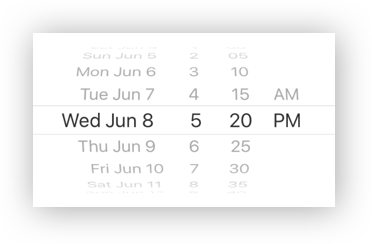  

**`Code snippet "date picker" example.`**
  
```html
<!-- .wxml -->
>>>>>>> 7521e1fb90ce0159bfeffc4218f29dd18727585a
<picker mode="date" value="{{date}}" start="2015-09-01" end="2020-09-01" bindchange="bindDateChange">
  <view class="picker">
    Now the date is {{date}}
 </view>
</picker>

```  
  
```javascript
// .js
Page({
  data: {
    date: '2017-05-20'
  },
  bindDateChange: function (e) {
    this.setData({
      date: e.detail.value
    })
  },
<<<<<<< HEAD
})    
```

**Date selector attributes:**   

   
 

### Switch
A switch is a visual toggle with two states, on and off.  

   
    

**`Code snippet "switch" example.`** 
  
```html
<!-- .wxml -->
<view class="body-view">
  <switch checked bindchange="switch1Change"/>
  <switch bindchange="switch2Change"/>
</view>
```

```javascript
// .js
Page({
  switch1Change: function (e){
    console.log('switch1 a change event occurs with the value', e.detail.value)
  },
  switch2Change: function (e){
    console.log('switch2 a change event occurs with the value', e.detail.value)
  }
})
```

 **Switch attributes:**  
 
   

### Toast  
A toast is a non-modal element used to display brief and auto-expiring components to **inform users.**

  
 
 In the code snippet below we are faking a form submission to show how a toast is working and display.
 
 **`Code snippet "spinner btn and toast" example.`**
   
```html
<!-- .wxml -->
<form bindsubmit="bindFormSubmit">
 <button type="primary" form-type="submit" loading="{{loading}}">Send</button>
</form>
```   
In the code snippet above we created a **dynamic button** with a **purpose of  submitting a form**. The button is animated 
by a [loading spinner](https://weui.io/#loadmore) when you click on it. 

 
 
Then we display a toast  by using `wx.showToast` API  to inform users. 

```javascript
Page({
  data: {
    loading: false
  },
  bindFormSubmit: function (e) {
    // Enable loading animation on send btn
    this.setData({
      loading: !this.data.loading
    })
    // Loading toast
    wx.showToast({
      title: 'Sending...',
      icon: 'loading',
      duration: 1500
    })
  }
})
```  


### Modal 

A modal box allows to **overlay a small element over a page**. The primary benefit of modal boxes it that they avoid the need to use of conventional window pop-ups or page reloads.

 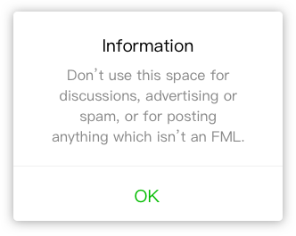

There are five situational categories where modal boxes are commonly used:

- **Error:** To alert users of an error.
- **Warning:** To warn users of potentially harmful situations.
- **Data:** To collect data from users.
- **Confirm or Prompt:** To remind users to do something before moving on.
- **Helper:** To inform users of important information.

 **`Code snippet "modal to inform" example.`**

```javascript
wx.showModal({
   title: 'Modal title',
   content: 'Modal content ',
   confirmText: "Ok",
   showCancel: false,
   success: function (res) {        
      console.log('success')
   }
 })
```


**Modal parameters:**


### Scroll view 
Scroll views has one main purpose, it lets users drag the area of the content they want to display. Mostly used to **scroll content that will not fit entirely on the screen**.
Scroll view can  be divided into horizontal and vertical scrolling.  

**`Code snippet  "vertical scroll view" example.`**


```html
<!-- .wxml -->
<scroll-view scroll-y="true" style="height: 200px;" bindscrolltoupper="upper" bindscrolltolower="lower" bindscroll="scroll" scroll-into-view="{{toView}}" scroll-top="{{scrollTop}}">
  <view id="green" class="scroll-view-item bc_green"></view>
  <view id="red"  class="scroll-view-item bc_red"></view>
  <view id="yellow" class="scroll-view-item bc_yellow"></view>
  <view id="blue" class="scroll-view-item bc_blue"></view>
</scroll-view>
```
**Note:** whenever using vertical scroll, you must set the height in WXSS otherwise scroll will not take effect.
 
```javascript
// .js
Page({
  data: {
    toView: 'red',
    scrollTop: 100
  },
  upper: function(e) {
    console.log(e)
  },
  lower: function(e) {
    console.log(e)
  },
  scroll: function(e) {
    console.log(e)
  }
}) 
```

**Scroll view attributes description:**  

   
 
## Leancloud DB

This tutorial aims to explain the different **setps you have to follow** if you want to **persist data and fetch data stored**  in a database for your mini-program.

**Let me give you some context first:**  
The use case below is based on a mini-program that has been developed in a purpose of gathering feedback through a form and persist the data collected  on Leancloud. To make this tutorial more coherent, we decided to add a section on how to fetch and display data stored on Leancloud. To illustrate this second section (fetch data) we created a new page that display all reviews gathered by the form and stored on Leancloud.


Here is the [Github repository](https://github.com/apelegri/wagonform-wechat-mp) of the project used to create this tutorial. 


**Specs:**
  
1. [Create a form](#create-a-form).
2. [Setup Leancloud](#install-and-initialize-leancloud) in your mini-program.
3. [Create an object and encapsulate data](#create-an-object-and-encapsulate-data) you want to persist.
4. [Persist objects on Leancloud](#persist-objects-on-leancloud).
5. Create your table within [Leancloud dashboard](#leancloud-dashboard).
6. Create a new review page and a button to redirect users to this review page.
7. [Fetch data](#fetch-data-stored-on-leancloud) from Leancloud and display reviews.

### Create a form 

**`Code snippet "create a form" example.`**

```html 
<!-- pages/form/form.wxml -->
<form bindsubmit="bindFormSubmit">
  <view>About the workshop</view>
  <view>Generally how was this workshop?</view>
  <text>Hints: takeaway, speed, time, location, people...</text>
  <view>
   <textarea name="review" maxlength="-1" />
  </view>
  <!-- Refer to the Github repository above if you want the complete form -->
  <button type="primary" form-type="submit">Send</button>
 </form>
```
When the **structure of the form** is created as above, next we need to **create the event**  which is trigerred by the form submission.

```javascript
//pages/form/form.js
Page({
  data:{
    loading: false,
  },
  // Form Submission
  bindFormSubmit: function(e) {
    // Local storage
    var review = e.detail.value.review
    var recommendation = e.detail.value.recommendation
    var learntocode = e.detail.value.learntocode
    var hearAbout = e.detail.value.hearAbout
    var nickName = e.detail.value.nickName
    var email = e.detail.value.email
    var phone = e.detail.value.phone  
  } 
})
```

**Local storage:**   
In the `bindFormSubmit` function, we assigned user's inputs to local variables in the purpose of testing if we can collect form's user inputs locally.  

### Install and initialize Leancloud

Before we begin the installation, if you are in development  white list your domain name by checking up the last checkbox of the project interface within your [WeChat IDE](#wechat-ide)  . For specific debugging needs you can follow this [Leancloud tutorial](https://leancloud.cn/docs/weapp-domains.html).

To get started with Leancloud setup, first [create an account](https://leancloud.cn/dashboard/login.html#/signup) on Leancloud.   

Now that you are ready for the installation and initialization of Leancloud in your mini-program you can follow their [documentation](https://leancloud.cn/docs/weapp.html#存储) that will let you go through a **two-step process:** 
 
-  The installation of the **av-weapp-min.js**  in your  **utils** folder. 
-  The initialization of  the app by adding Leancloud `appId` and `appKey` in your **app.js**.

```javascript
// app.js
// Require Leancloud library (the av-weapp-min.js file you just add).
const AV = require('./utils/av-weapp-min.js');

// Initialization of the app
AV.init({ 
 appId: 't6hUVJfOwjHuWXuD9OE06rxxxxxxxxxxxx', 
 appKey: 'HndT17mJ7wAIxsv8uxxxxxxxxxx', 
});
```

If you are lost refer to the [Github repository](https://github.com/apelegri/wagonform-wechat-mp) of the project. 

### Create an object and encapsulate data 

In the first place, create a new folder called **model** and **add** a `form.js` file to this folder. Named your file in accordance with the kind of object you want to persist, in this case a **form.** This step is not required but permits to keep your **files organised.** 

**Let's create the object:**  
In the **form.js** file you just created, require **av-weapp-min.js**  you installed in **util.js** and assigns it to an `AV` constant. Then instantiate the `From` object. 
 
 **`Code snippet "require Leancloud and create an object" example.`**  

```javascript 
// model/form.js
const AV = require('../utils/av-weapp-min.js');
class Form extends AV.Object {
}
``` 

Now that you have instantiated the `Form` object,  **create the  form object** to **encapsulate data**  in the logical layer (here form.js)  and redirect user after the form submission.

**`Code snippet "bindFormSubmit function" example.`** 

```javascript  
const AV = require('../../utils/av-weapp-min.js');
const form = require('../../model/form.js');

// pages/form/form.js
bindFormSubmit: function(e) {
   // Local storage
   console.log(e)
   var review = e.detail.value.review
   var recommendation = e.detail.value.recommendation
   var learntocode = e.detail.value.learntocode
   var heardAbout = e.detail.value.heardAbout
   var nickName = e.detail.value.nickName
   var email = e.detail.value.email
   var phone = e.detail.value.phone
   
   // Leancloud permissions
   var acl = new AV.ACL();
   acl.setPublicReadAccess(true);
   acl.setPublicWriteAccess(true);
  
   // Leancloud storage
   setTimeout(function(){
     new Form({
       name: nickName,
       email: email,
       phone: phone,
       review: review,
       recommendation: recommendation,
       learn_to_code: learntocode,
       heard_about: heardAbout
     }).setACL(acl).save().catch(console.error);
    
    // Redirect user
    wx.reLaunch({
      url: '/pages/wagon/wagon?form=1'
    });
    }, 2000);
  }
})
``` 

**Code snippet debrief:**  

1. Inside the `binFormSubmit` function we added **permissions** that allow Leancloud to **read and write through the object** we created and want to persist.  
2. We defined a function `setTimeout` that **encapsulate data** in the  new `Form`object and **redirect user** when the form is submitted. 

**Note:** `setACL(acl)` is a Leancloud [built-in property](https://leancloud.cn/docs/leanstorage_guide-js.html#保存对象).

### Persist objects on Leancloud

Now that we have encapsulated data in the object, we have to **persist the object on Leancloud** through the use of a [module](#module). 

**`Code snippet "persist the object on Leancloud" example.`**

```javascript 
// model/form.js
const AV = require('../utils/av-weapp-min.js');
class Form extends AV.Object {
}

// Register object
AV.Object.register(Form, 'Form');

// Export object
module.exports = Form;
```
 
### Leancloud dashboard
So far everything is done within your mini-program, what remains to be done is a **projection** of  the data collected **within your Leancloud dashboard**.

- **Create a project** in your Leancloud dashboard.
- **Create a table** in this project by adding the class object you created, such as a `Form` class in this exemple.  
- **Add columns** to your table (be cautionous on the data type you specify when you add your columns). 

**Test it** to be sure that the data collected, is persisted within your Leancloud dashboard.

### Module

In Javascript a [module](https://medium.freecodecamp.com/javascript-modules-a-beginner-s-guide-783f7d7a5fcc) refers to a small units of independent, reusable code. It is interpreted as **moving all related functions** into a file. `exports` is an object that will be **exposed as a module.** So whatever you assign to a `module.exports`, it will be exposed as a module.  In this case `module.exports` send the `Form` object  to Leancloud.

### Fetch data stored on Leancloud 

First let me remind you the background of this section. We want to **display in a new page the list of reviews** we have **collected and persisted on Leancloud** through the form we have created above. I assume that you have followed the first section of the tutorial, [(if you missed it see above)](#leancloud-db).

**Sepcs:**

- Create a new page called `review`.
- Fetch data from Leancloud and display all reviews stored. 

So let's create a new review page and a button that **redirects to review page**.
 (**tip:** just add the route path to your **app.json**, the framework will create the new page folder and files by itself). 

```html
<!-- index.html -->
<!-- CTA redirects to review page -->
<view class="cta-margin">
 <navigator url="/pages/review/review" class="btn-index">Reviews</navigator>
</view>
```

The next step is to **fetch data stored on Leancloud and displays it**.

**`Code snippet "fetch data stored on Leancloud and displays it" example.`**

```html
<!-- review.wxml --> 
<block wx:for="{{forms}}" wx:for-item="form" wx:key="objectId">
 <text data-id="{{form.objectId}}" >
  {{form.review}}
 </text>
 <text> 
  - {{form.name}}
 </text>
</block>
``` 
Above we created a **list rendering block** using `wx:for` that display each review and name of the person who creates the review.

```javascript
// pages/review/review.js
// Require leancloud and object 
const AV = require('../../utils/av-weapp-min.js');
const Form = require('../../model/form.js');

// Fetch data from Leancloud
Page({
  data: {
    forms: []
  },
  onReady: function() {
    new AV.Query('Form')
      .descending('createdAt')
      .find()
      .then(forms => this.setData({ forms }))
      .catch(console.error);
  }, 
})
```

**Code snippet debrief:**    

1. We are doing a **query** on the`AV` object which contains the data stored.
2. Then we are **sorting out** each form according to its creation date to finish by setting up the `forms` array. 
3.  Display data in the view using the Mustache syntax.


### Recommendations:
In this use case we have just seen **how to store data** we collect locally to Leancloud and **how to fetch data stored** from Leancloud. 

I recommend that you read [Leancloud documentation](https://leancloud.cn/docs/leanstorage_guide-js.html#获取对象 ) or check LeanTodo mini-program created by Leancloud, [Github repository](https://github.com/leancloud/leantodo-weapp)  and dig in facilities Leancloud offers.  

### Production: domain name whitelist

When you are in production you have to **configure Leancloud domain name** within WeChat platform. [Follow this leancloud tutorial](https://leancloud.cn/docs/weapp-domains.html).  


## WeChat API 

### Get user information
WeChat "quickstart" (WeChat boilerplate) gives you a `getUserInfo` function in the **app.js** file. As the name suggests, this function is meant to **obtain user information**. Let’s go through this function step by step.

 
**General description:**  

1. `getUserInfo` function has a parameter **cb**, which is also a function.
2.  The `If` block of  `getUserInfo` function will be passed if `userInfo` from `globalData` is not null. 
3. Otherwise `userInfo` is null, `getUserInfo` function calls the login interface.

```javascript
// app.js
App({
  getUserInfo:function(cb){
    var that = this
    if(this.globalData.userInfo){
      typeof cb == "function" && cb(this.globalData.userInfo)
    }else{
      // Login interface call
      wx.login({
        success: function () {
          wx.getUserInfo({
            success: function (res) {
              that.globalData.userInfo = res.userInfo
              typeof cb == "function" && cb(that.globalData.userInfo)
            }
          })
        }
      })
    }
  },
  globalData:{
    userInfo:null
  }
})
```  
**First case, `userInfo` form `globalData`  is not null**

The if condition statement aims to determine if **cb argument** passed to get `getUserInfo` is a function type and if it is a funcion it will pass `userInfo`.

**How they figure out if cb parameter is a function?**

```javascript
// index.js
var app = getApp()
Page({
  data: {
    userInfo: {},
  },
  onLoad: function () {
    console.log('onLoad')
    var that = this
    app.getUserInfo(function(userInfo){
      that.setData({
        userInfo:userInfo
      })
    })
  }
}
```

**Let's go through this `onLoad` function of index.js**  

1. The `onLoad` function calls  `getUserInfo`  function **on the app instance**.
2.  They **define a function as a parameter** that update `userInfo` to current user information. 
3.  And pass `userInfo` updated to `globalData`  in the **app.js** file. 

**Second case, userInfo is null**  

1. If `userInfo` is null `getUserInfo` function returns the `else` statement which calls the login interface. 
2.  Then the current user successfully log in, `getUserInfo` is called and act as the `if` block we saw above. 

If current user is already log in, **user information are assigned to** `globalData` through **index.js** page which calls `onLaod` function. And then the same logic is applied. 


### Data cache

Wechat mini-programs have a **mechanism of cache in their API.** In fact, each mini-program has its own **local cache storage.** 

**Reminder:**  
Cache storage is used to store data we want to access quickly. It **reduces user waiting time**, since the **request** is satisfied **from the local cache** which is closer to clients compared to the original server used to request your DB.


Cache storage offers **two kind of methods** to store data in the cache:

-  The **synchronous method** ,`wx.setStorage`:

 ```javascript
wx.setStorage ({key: 'name', data: 'Thibault'});
```

 `wx.setStorage` build parameters as a json, a key to specified the stored key and data to specified the key value to store. 

- The **asynchronous method**, `wx.setStorageSync`:
 
 ```javascript
wx.setStorageSync ('name', 'Thibault');
```

 `wx.setStorageSync` syntax is simpler,  parameters are directly passed. And can get data through the incoming callback function.


**WeChat provides three main actions on the cache:**
  
- Save data in the cache,  `wx.setStorage`  or `wx.setStorageSync`.
- Read data from the cache,   `wx.getStorage` or `wx.getStorageSync`.
- Clear data of the cache,  `wx.clearStorage` or `wx.clearStorageSync`.
- Remove data in the cache, `wx.removeStorage` or `wx.removeStorageSync`.

**`Code snippet "set cache and get data from cache (synchronous method)" exemple`**. 

```html
<!-- .wxml -->
<button type="primary" bindtap="listenerStorageSave">Save data to cache</button>
  <text>{{dataCache}}</text>
<button type="primary" bindtap="listenerStorageGet">Get data stored</button>
```

```javascript
// index.js
Page({ 
  data: {
    dataCache: {
      key: 'Key',
      data: 'Data'
    }
   } 
   // Set storage 
   listenerStorageSave: function () {
     wx.setStorage({
       key: 'key',
       data: "I'm storing  data in the cache synchronously",
       success: function (res) {
         console.log(res)
       }
     })
   },
  // Get storage  
  listenerStorageGet: function() {
    var that = this;
    wx.getStorage({
      key: 'key',
      success: function(res) {
        console.log(res)
        that.setData({
          dataCache: res.data
        })
      }
    })
  }
})
```


### Open the QR code scanner
You can **call up** your **client code scanner UI** by using the `wx.scanCode` API. It gives direct access to the WeChat scanner through a CTA button with the aim of scanning a QR code.

**`Code snippet "call up client code scanner"  example.`** 

```html 
<!-- .wxml -->  
<view class="btn-area">
 <button bindtap="bindScan">Scan</button>
</view>
```

```javascript
// .js
 bindScan: function () {
   console.log('scanner')
   wx.scanCode({
     success: (res) => {
      console.log(res)
    }
  })
 }
```

### Location-based services

WeChat API provides a full set of location-based services:  

- **`wx.chooseLocation`** to choose the location you want to display.
- **`wx.getLocation`** to get current user location.
- **`wx.openLocation`** to display location on their **buit-in map view**. 
- **`wx.createMapContext`** to personalize your map.


**`Code snippet "get location" example.`**

```html
<!-- .wxml --> 
<button type="primary" bindtap="listenerBtnGetLocation">Get location</button>
```   

```javascript
// .js
listenerBtnGetLocation: function () {
  wx.getLocation({
  type: 'wgs84',
  success: function(res) {
    var latitude = res.latitude
    var longitude = res.longitude
    var speed = res.speed
    var accuracy = res.accuracy
     console.log(res)
   }
  })
 }
```

Above we used the `wx.getLocation` to retrieve current user  position by getting his **latitude** and **longitude.**

**`wx.getLocation` further details:**  
If a user leaves the mini-program but display on top of his chat the mini-program  you can continue to call  `wx.getLocation`and so get user location continiously.

**Display the current user location on WeChat built-in map:**  
`wx.openLocation`API call, enables the opening  of  WeChat built-in map view in order to display the location you got from `listenerBtnGetLocation` function we created above. 

**Note:** `wx.openLocation` API call, redirects user directly on a new map window. 

**`Code snippet "display the current user location" example.`**

 ```javascript
 // .js 
listenerBtnGetLocation: function () {
  wx.getLocation({
  type: 'wgs84',
  success: function(res) {
    var latitude = res.latitude
    var longitude = res.longitude
    wx.openLocation({
      latitude: latitude,
      longitude: longitude,
      scale: 28
    })
   }
  })
 }
 ```
 

### Image

 WeChat image API offers four possibilities:

- **`wx.chooseImage`** to choose an image from your album or camera.
- **`wx.previewImage`** to preview the image before the upload on the app.
-  **`wx.getImageInfo`** to get image information (height, width, path, src).
- **`wx.saveImageToPhotosAlbum`** to save image from the mini-program to your album.


In the example below we create a function  called `listenerBtnChooseImage` with the aim of calling  user album or camera by using `wx.chooseImage`.  Then we are using `wx.getImageInfo` to get image information.

**`Code snippet "upload an image form album or camera" example.`**

```html
<!-- .wxml --> 
<button type="primary" bindtap="listenerBtnChooseImage">Upload Image</button>
<!-- Display the image user upload --> 
<image src="{{src}}" mode="aspecFill"  bindlongtap="imgLongTap"/>
```

```javascript
// .js
Page({
  data: {
    src: []
  },
  listenerBtnChooseImage: function () {
    var that = this
    // Upload an image
    wx.chooseImage({
      count: 1,
      sizeType: ['original', 'compressed'], 
      sourceType: ['album', 'camera'],
      success: function (res) {
        console.log('success')
        that.setData({
          src: res.tempFilePaths
        })
        // Get image info
        wx.getImageInfo({
          src: res.tempFilePaths[0],
          success: function (res) {
            console.log(res.width)
            console.log(res.height)
            console.log(res.path) 
          }
        })
       }
     })  
   } 
})
```

Now that we have an image on the page let's save the image from the mini-program to current user album by long tapping the image. 

**`Code snippet "long tap the image to save it within user album" example.`**

```html
<!-- .wxml -->  
<image src="{{src}}" mode="aspecFill"  bindlongtap="imgLongTap"/>
```

```javascript 
// .js
Page({
  data: {
    src: []
  },
  listenerBtnChooseImage: function () {
    var that = this
    // Upload an image
    wx.chooseImage({
      count: 1,
      sizeType: ['original', 'compressed'], 
      sourceType: ['album', 'camera'],
      success: function (res) {
        console.log('success')
        that.setData({
          src: res.tempFilePaths
        })
        // Get image info
        wx.getImageInfo({
          src: res.tempFilePaths[0],
          success: function (res) {
            console.log(res.width)
            console.log(res.height)
            console.log(res.path) 
          }
        })
       }
     })  
   } ,
   // Longtap function 
   imgLongTap: function (){
      // Save image to album 
      wx.saveImageToPhotosAlbum({
        filePath: this.data.src,
        success(res) {
          wx.showToast({
            title: 'Save',
            icon: 'success',
            duration: 1500
          })
        console.log('success')
      }
    })
  } 
})  
```
=======
})    
```

**Date selector attributes:**   

   
 

### Switch
A switch is a visual toggle with two states, on and off.  

   
    

**`Code snippet "switch" example.`** 
  
```html
<!-- .wxml -->
<view class="body-view">
  <switch checked bindchange="switch1Change"/>
  <switch bindchange="switch2Change"/>
</view>
```

```javascript
// .js
Page({
  switch1Change: function (e){
    console.log('switch1 a change event occurs with the value', e.detail.value)
  },
  switch2Change: function (e){
    console.log('switch2 a change event occurs with the value', e.detail.value)
  }
})
```

 **Switch attributes:**  
 
   

### Toast  
A toast is a non-modal element used to display brief and auto-expiring components to **inform users.**

  
 
 **`Code snippet "spinner btn and toast" example.`**
   
```html
<!-- .wxml -->
<button type="primary" form-type="submit" loading="{{loading}}">Send</button>
```   
In the code snippet above we created a **dynamic button** with a **purpose of  submitting a form**. The button is animated 
by a [loading spinner](https://weui.io/#loadmore) when you click on it. 

 
 
Then we display a toast  by using `wx.showToast` API  to inform users. 

```javascript
// .js
Page({
  data:{
    loading: false
  },
 // Enable loading animation on send btn
 this.setData({
   loading: !this.data.loading
 })
 // Loading toast
 wx.showToast({
    title: 'Sending...',
    icon: 'loading',
    duration: 1500
 })
}) 
```  


### Modal 

A modal box allows to **overlay a small element over a page**. The primary benefit of modal boxes it that they avoid the need to use of conventional window pop-ups or page reloads.

 

There are five situational categories where modal boxes are commonly used:

- **Error:** To alert users of an error.
- **Warning:** To warn users of potentially harmful situations.
- **Data:** To collect data from users.
- **Confirm or Prompt:** To remind users to do something before moving on.
- **Helper:** To inform users of important information.

 **`Code snippet "modal to inform" example.`**

```javascript
wx.showModal({
   title: 'Modal title',
   content: 'Modal content ',
   confirmText: "Ok",
   showCancel: false,
   success: function (res) {        
      console.log('success')
   }
 })
```


**Modal parameters:**


### Scroll view 
Scroll views has one main purpose, it lets users drag the area of the content they want to display. Mostly used to **scroll content that will not fit entirely on the screen**.
Scroll view can  be divided into horizontal and vertical scrolling.  

**`Code snippet  "vertical scroll view" example.`**


```html
<!-- .wxml -->
<scroll-view scroll-y="true" style="height: 200px;" bindscrolltoupper="upper" bindscrolltolower="lower" bindscroll="scroll" scroll-into-view="{{toView}}" scroll-top="{{scrollTop}}">
  <view id="green" class="scroll-view-item bc_green"></view>
  <view id="red"  class="scroll-view-item bc_red"></view>
  <view id="yellow" class="scroll-view-item bc_yellow"></view>
  <view id="blue" class="scroll-view-item bc_blue"></view>
</scroll-view>
```
**Note:** whenever using vertical scroll, you must set the height in WXSS otherwise scroll will not take effect.
 
```javascript
// .js
Page({
  data: {
    toView: 'red',
    scrollTop: 100
  },
  upper: function(e) {
    console.log(e)
  },
  lower: function(e) {
    console.log(e)
  },
  scroll: function(e) {
    console.log(e)
  }
}) 
```

**Scroll view attributes description:**  

   
 
## Leancloud DB

This tutorial aims to explain the different **setps you have to follow** if you want to **persist data and fetch data stored**  in a database for your mini-program.

**Let me give you some context first:**  
The use case below is based on a mini-program that has been developed in a purpose of gathering feedback through a form and persist the data collected  on Leancloud. To make this tutorial more coherent, we decided to add a section on how to fetch and display data stored on Leancloud. To illustrate this second section (fetch data) we created a new page that display all reviews gathered by the form and stored on Leancloud.


Here is the [Github repository](https://github.com/apelegri/wagonform-wechat-mp) of the project used to create this tutorial. 


**Specs:**
  
1. [Create a form](#create-a-form).
2. [Setup Leancloud](#install-and-initialize-leancloud) in your mini-program.
3. [Create an object and encapsulate data](#create-an-object-and-encapsulate-data) you want to persist.
4. [Persist objects on Leancloud](#persist-objects-on-leancloud).
5. Create your table within [Leancloud dashboard](#leancloud-dashboard).
6. Create a new review page and a button to redirect users to this review page.
7. [Fetch data](#fetch-data-stored-on-leancloud) from Leancloud and display reviews.

### Create a form 

**`Code snippet "create a form" example.`**

```html 
<!-- pages/form/form.wxml -->
<form bindsubmit="bindFormSubmit">
 <view class="header-form">
  <view class="h2-form">About the workshop</view>
 </view>
 <view class="user-input">
  <view class="input-label">Generally how was this workshop?</view>
  <text class="label-details">Hints: takeaway, speed, time, location, people...</text>
  <view class="text-area-wrp">
   <textarea class="input-height" name="review" maxlength="-1" />
  </view>
  <!-- Refer to the Github repository above if you want the complete form -->
  <button type="primary" form-type="submit">Send</button>
 </form>
</view>
```
When the **structure of the form** is created as above, next we need to **create the event**  which is trigerred by the form submission.

```javascript
//pages/form/form.js
Page({
  data:{
    loading: false,
  },
  // Form Submission
  bindFormSubmit: function(e) {
    // Local storage
    var review = e.detail.value.review
    var recommendation = e.detail.value.recommendation
    var learntocode = e.detail.value.learntocode
    var hearAbout = e.detail.value.hearAbout
    var nickName = e.detail.value.nickName
    var email = e.detail.value.email
    var phone = e.detail.value.phone  
  } 
})
```

**Local storage:**   
In the `bindFormSubmit` function, we assigned user's inputs to local variables in the purpose of testing if we can collect form's user inputs locally.  

### Install and initialize Leancloud

Before we begin the installation, if you are in development  white list your domain name by checking up the last checkbox of the project interface within your [WeChat IDE](#wechat-ide)  . For specific debugging needs you can follow this [Leancloud tutorial](https://leancloud.cn/docs/weapp-domains.html).

To get started with Leancloud setup, first [create an account](https://leancloud.cn/dashboard/login.html#/signup) on Leancloud.   

Now that you are ready for the installation and initialization of Leancloud in your mini-program you can follow their [documentation](https://leancloud.cn/docs/weapp.html#存储) that will let you go through a **two-step process:** 
 
-  The installation of the **av-weapp-min.js**  in your  **util.js** file. 
-  The initialization of  the app by adding Leancloud `appId` and `appKey` in your **app.js**.

```javascript
// app.js
// Require Leancloud library (the av-weapp-min.js file you just add).
const AV = require('./utils/av-weapp-min.js');

// Initialization of the app
AV.init({ 
 appId: 't6hUVJfOwjHuWXuD9OE06rxxxxxxxxxxxx', 
 appKey: 'HndT17mJ7wAIxsv8uxxxxxxxxxx', 
});
```

If you are lost refer to the [Github repository](https://github.com/apelegri/wagonform-wechat-mp) of the project. 

### Create an object and encapsulate data 

In the first place, create a new folder called **model** and **add** a `form.js` file to this folder. Named your file in accordance with the kind of object you want to persist, in this case a **form.** This step is not required but permits to keep your **files organised.** 

**Let's create the object:**  
In the **form.js** file you just created, require **av-weapp-min.js**  you installed in **util.js** and assigns it to an `AV` constant. Then instantiate the `From` object. 
 
 **`Code snippet "require Leancloud and create an object" example.`**  

```javascript 
// model/form.js
const AV = require('../utils/av-weapp-min.js');
class Form extends AV.Object {
}
``` 

Now that you have instantiated the `Form` object,  **create the  form object** to **encapsulate data**  in the logical layer (here form.js)  and redirect user after the form submission.

**`Code snippet "bindFormSubmit function" example.`** 

```javascript  
// pages/form/form.js
bindFormSubmit: function(e) {
   // Local storage
   console.log(e)
   var review = e.detail.value.review
   var recommendation = e.detail.value.recommendation
   var learntocode = e.detail.value.learntocode
   var heardAbout = e.detail.value.heardAbout
   var nickName = e.detail.value.nickName
   var email = e.detail.value.email
   var phone = e.detail.value.phone
   
   // Leancloud permissions
   var acl = new AV.ACL();
   acl.setPublicReadAccess(true);
   acl.setPublicWriteAccess(true);
  
   // Leancloud storage
   setTimeout(function(){
     new Form({
       name: nickName,
       email: email,
       phone: phone,
       review: review,
       recommendation: recommendation,
       learn_to_code: learntocode,
       heard_about: heardAbout
     }).setACL(acl).save().catch(console.error);
    
    // Redirect user
    wx.reLaunch({
      url: '/pages/wagon/wagon?form=1'
    });
    }, 2000);
  }
})
``` 

**Code snippet debrief:**  

1. Inside the `binFormSubmit` function we added **permissions** that allow Leancloud to **read and write through the object** we created and want to persist.  
2. We defined a function `setTimeout` that **encapsulate data** in the  new `Form`object and **redirect user** when the form is submitted. 

**Note:** `setACL(acl)` is a Leancloud [built-in property](https://leancloud.cn/docs/leanstorage_guide-js.html#保存对象).

### Persist objects on Leancloud

Now that we have encapsulated data in the object, we have to **persist the object on Leancloud** through the use of a [module](#module). 

**`Code snippet "persist the object on Leancloud" example.`**

```javascript 
// model/form.js
const AV = require('../utils/av-weapp-min.js');
class Form extends AV.Object {
}

// Register object
AV.Object.register(Form, 'Form');

// Export object
module.exports = Form;
```
 
### Leancloud dashboard
So far everything is done within your mini-program, what remains to be done is a **projection** of  the data collected **within your Leancloud dashboard**.

- **Create a project** in your Leancloud dashboard.
- **Create a table** in this project by adding the class object you created, such as a `Form` class in this exemple.  
- **Add columns** to your table (be cautionous on the data type you specify when you add your columns). 

**Test it** to be sure that the data collected, is persisted within your Leancloud dashboard.

### Module

In Javascript a [module](https://medium.freecodecamp.com/javascript-modules-a-beginner-s-guide-783f7d7a5fcc) refers to a small units of independent, reusable code. It is interpreted as **moving all related functions** into a file. `exports` is an object that will be **exposed as a module.** So whatever you assign to a `module.exports`, it will be exposed as a module.  In this case `module.exports` send the `Form` object  to Leancloud.

### Fetch data stored on Leancloud 

First let me remind you the background of this section. We want to **display in a new page the list of reviews** we have **collected and persisted on Leancloud** through the form we have created above. I assume that you have followed the first section of the tutorial, [(if you missed it see above)](#leancloud-db).

**Sepcs:**

- Create a new page called `review`.
- Fetch data from Leancloud and display all reviews stored. 

So let's create a new review page and a button that **redirects to review page**.
 (**tip:** just add the route path to your **app.json**, the framework will create the new page folder and files by itself). 

```html
<!-- index.html -->
<!-- CTA redirects to review page -->
<view class="cta-margin">
 <navigator url="/pages/review/review" class="btn-index">Reviews</navigator>
</view>
```

The next step is to **fetch data stored on Leancloud and displays it**.

**`Code snippet "fetch data stored on Leancloud and displays it" example.`**

```html
<!-- review.wxml --> 
<block wx:for="{{forms}}" wx:for-item="form" wx:key="objectId">
 <text data-id="{{form.objectId}}" >
  {{form.review}}
 </text>
 <text> 
  - {{form.name}}
 </text>
</block>
``` 
Above we created a **list rendering block** using `wx:for` that display each review and name of the person who creates the review.

```javascript
// pages/review/review.js
// Require leancloud and object 
const AV = require('../../utils/av-weapp-min.js');
const Form = require('../../model/form.js');

// Fetch data from Leancloud
Page({
  data: {
    forms: []
  },
  onReady: function() {
    new AV.Query('Form')
      .descending('createdAt')
      .find()
      .then(forms => this.setData({ forms }))
      .catch(console.error);
  }, 
})
```

**Code snippet debrief:**    

1. We are doing a **query** on the`AV` object which contains the data stored.
2. Then we are **sorting out** each form according to its creation date to finish by setting up the `forms` array. 
3.  Display data in the view using the Mustache syntax.


### Recommendations:
In this use case we have just seen **how to store data** we collect locally to Leancloud and **how to fetch data stored** from Leancloud. 

I recommend that you read [Leancloud documentation](https://leancloud.cn/docs/leanstorage_guide-js.html#获取对象 ) or check LeanTodo mini-program created by Leancloud, [Github repository](https://github.com/leancloud/leantodo-weapp)  and dig in facilities Leancloud offers.  

### Production: domain name whitelist

When you are in production you have to **configure Leancloud domain name** within WeChat platform. [Follow this leancloud tutorial](https://leancloud.cn/docs/weapp-domains.html).  


## WeChat API 

### Get user information
WeChat "quickstart" (WeChat boilerplate) gives you a `getUserInfo` function in the **app.js** file. As the name suggests, this function is meant to **obtain user information**. Let’s go through this function step by step.

 
**General description:**  

1. `getUserInfo` function has a parameter **cb**, which is also a function.
2.  The `If` block of  `getUserInfo` function will be passed if `userInfo` from `globalData` is not null. 
3. Otherwise `userInfo` is null, `getUserInfo` function calls the login interface.

```javascript
// app.js
App({
  getUserInfo:function(cb){
    var that = this
    if(this.globalData.userInfo){
      typeof cb == "function" && cb(this.globalData.userInfo)
    }else{
      // Login interface call
      wx.login({
        success: function () {
          wx.getUserInfo({
            success: function (res) {
              that.globalData.userInfo = res.userInfo
              typeof cb == "function" && cb(that.globalData.userInfo)
            }
          })
        }
      })
    }
  },
  globalData:{
    userInfo:null
  }
})
```  
**First case, `userInfo` form `globalData`  is not null**

The if condition statement aims to determine if **cb argument** passed to get `getUserInfo` is a function type and if it is a funcion it will pass `userInfo`.

**How they figure out if cb parameter is a function?**

```javascript
// index.js
var app = getApp()
Page({
  data: {
    userInfo: {},
  },
  onLoad: function () {
    console.log('onLoad')
    var that = this
    app.getUserInfo(function(userInfo){
      that.setData({
        userInfo:userInfo
      })
    })
  }
}
```

**Let's go through this `onLoad` function of index.js**  

1. The `onLoad` function calls  `getUserInfo`  function **on the app instance**.
2.  They **define a function as a parameter** that update `userInfo` to current user information. 
3.  And pass `userInfo` updated to `globalData`  in the **app.js** file. 

**Second case, userInfo is null**  

1. If `userInfo` is null `getUserInfo` function returns the `else` statement which calls the login interface. 
2.  Then the current user successfully log in, `getUserInfo` is called and act as the `if` block we saw above. 

If current user is already log in, **user information are assigned to** `globalData` through **index.js** page which calls `onLaod` function. And then the same logic is applied. 


### Data cache

Wechat mini-programs have a **mechanism of cache in their API.** In fact, each mini-program has its own **local cache storage.** 

**Reminder:**  
Cache storage is used to store data we want to access quickly. It **reduces user waiting time**, since the **request** is satisfied **from the local cache** which is closer to clients compared to the original server used to request your DB.


Cache storage offers **two kind of methods** to store data in the cache:

-  The **synchronous method** ,`wx.setStorage`:

 ```javascript
wx.setStorage ({key: 'name', data: 'Thibault'});
```

 `wx.setStorage` build parameters as a json, a key to specified the stored key and data to specified the key value to store. 

- The **asynchronous method**, `wx.setStorageSync`:
 
 ```javascript
wx.setStorageSync ('name', 'Thibault');
```

 `wx.setStorageSync` syntax is simpler,  parameters are directly passed. And can get data through the incoming callback function.


**WeChat provides three main actions on the cache:**
  
- Save data in the cache,  `wx.setStorage`  or `wx.setStorageSync`.
- Read data from the cache,   `wx.getStorage` or `wx.getStorageSync`.
- Clear data of the cache,  `wx.clearStorage` or `wx.clearStorageSync`.
- Remove data in the cache, `wx.removeStorage` or `wx.removeStorageSync`.

**`Code snippet "set cache and get data from cache (synchronous method)" exemple`**. 

```html
<!-- .wxml -->
<button type="primary" bindtap="listenerStorageSave">Save data to cache</button>
  <text>{{dataCache}}</text>
<button type="primary" bindtap="listenerStorageGet">Get data stored</button>
```

```javascript
// index.js
Page({ 
  data: {
    dataCache: {
      key: 'Key',
      data: 'Data'
    }
   } 
   // Set storage 
   listenerStorageSave: function () {
     wx.setStorage({
       key: 'key',
       data: "I'm storing  data in the cache synchronously",
       success: function (res) {
         console.log(res)
       }
     })
   },
  // Get storage  
  listenerStorageGet: function() {
    var that = this;
    wx.getStorage({
      key: 'key',
      success: function(res) {
        console.log(res)
        that.setData({
          dataCache: res.data
        })
      }
    })
  }
})
```


### Open the QR code scanner
You can **call up** your **client code scanner UI** by using the `wx.scanCode` API. It gives direct access to the WeChat scanner through a CTA button with the aim of scanning a QR code.

**`Code snippet "call up client code scanner"  example.`** 

```html 
<!-- .wxml -->  
<view class="btn-area">
 <button bindtap="bindScan">Scan</button>
</view>
```

```javascript
// .js
 bindScan: function () {
   console.log('scanner')
   wx.scanCode({
     success: (res) => {
      console.log(res)
    }
  })
 }
```

### Location-based services

WeChat API provides a full set of location-based services:  

- **`wx.chooseLocation`** to choose the location you want to display.
- **`wx.getLocation`** to get current user location.
- **`wx.openLocation`** to display location on their **buit-in map view**. 
- **`wx.createMapContext`** to personalize your map.


**`Code snippet "get location" example.`**

```html
<!-- .wxml --> 
<button type="primary" bindtap="listenerBtnGetLocation">Get location</button>
```   

```javascript
// .js
listenerBtnGetLocation: function () {
  wx.getLocation({
  type: 'wgs84',
  success: function(res) {
    var latitude = res.latitude
    var longitude = res.longitude
    var speed = res.speed
    var accuracy = res.accuracy
     console.log(res)
   }
  })
 }
```

Above we used the `wx.getLocation` to retrieve current user  position by getting his **latitude** and **longitude.**

**`wx.getLocation` further details:**  
If a user leaves the mini-program but display on top of his chat the mini-program  you can continue to call  `wx.getLocation`and so get user location continiously.

**Display the current user location on WeChat built-in map:**  
`wx.openLocation`API call, enables the opening  of  WeChat built-in map view in order to display the location you got from `listenerBtnGetLocation` function we created above. 

**Note:** `wx.openLocation` API call, redirects user directly on a new map window. 

**`Code snippet "display the current user location" example.`**

 ```javascript
 // .js 
listenerBtnGetLocation: function () {
  wx.getLocation({
  type: 'wgs84',
  success: function(res) {
    var latitude = res.latitude
    var longitude = res.longitude
    wx.openLocation({
      latitude: latitude,
      longitude: longitude,
      scale: 28
    })
   }
  })
 }
 ```
 

### Image

 WeChat image API offers four possibilities:

- **`wx.chooseImage`** to choose an image from your album or camera.
- **`wx.previewImage`** to preview the image before the upload on the app.
-  **`wx.getImageInfo`** to get image information (height, width, path, src).
- **`wx.saveImageToPhotosAlbum`** to save image from the mini-program to your album.


In the example below we create a function  called `listenerBtnChooseImage` with the aim of calling  user album or camera by using `wx.chooseImage`.  Then we are using `wx.getImageInfo` to get image information.

**`Code snippet "upload an image form album or camera" example.`**

```html
<!-- .wxml --> 
<button type="primary" bindtap="listenerBtnChooseImage">Upload Image</button>
<!-- Display the image user upload --> 
<image src="{{src}}" mode="aspecFill"  bindlongtap="imgLongTap"/>
```

```javascript
// .js
Page({
  data: {
    src: []
  },
  listenerBtnChooseImage: function () {
    var that = this
    // Upload an image
    wx.chooseImage({
      count: 1,
      sizeType: ['original', 'compressed'], 
      sourceType: ['album', 'camera'],
      success: function (res) {
        console.log('success')
        that.setData({
          src: res.tempFilePaths
        })
        // Get image info
        wx.getImageInfo({
          src: res.tempFilePaths[0],
          success: function (res) {
            console.log(res.width)
            console.log(res.height)
            console.log(res.path) 
          }
        })
       }
     })  
   } 
})
```

Now that we have an image on the page let's save the image from the mini-program to current user album by long tapping the image. 

**`Code snippet "long tap the image to save it within user album" example.`**

```html
<!-- .wxml -->  
<image src="{{src}}" mode="aspecFill"  bindlongtap="imgLongTap"/>
```

```javascript 
// .js
Page({
  data: {
    src: []
  },
  listenerBtnChooseImage: function () {
    var that = this
    // Upload an image
    wx.chooseImage({
      count: 1,
      sizeType: ['original', 'compressed'], 
      sourceType: ['album', 'camera'],
      success: function (res) {
        console.log('success')
        that.setData({
          src: res.tempFilePaths
        })
        // Get image info
        wx.getImageInfo({
          src: res.tempFilePaths[0],
          success: function (res) {
            console.log(res.width)
            console.log(res.height)
            console.log(res.path) 
          }
        })
       }
     })  
   } ,
   // Longtap function 
   imgLongTap: function (){
      // Save image to album 
      wx.saveImageToPhotosAlbum({
        filePath: this.data.src,
        success(res) {
          wx.showToast({
            title: 'Save',
            icon: 'success',
            duration: 1500
          })
        console.log('success')
      }
    })
  } 
})  
```

